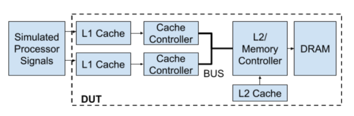

# MSI Cache Coherence Protocol Implementation

A complete Verilog RTL implementation of the MSI (Modified-Shared-Invalid) cache coherence protocol for a dual-core system with a two-level cache hierarchy.

---

## 📋 Project Overview

This project implements a realistic multi-processor cache coherence system featuring:

- **Two private L1 caches** (32KB each, 4-way set-associative)
- **One shared L2 cache** (128KB, 8-way set-associative)
- **MSI coherence protocol** with snoop-based invalidation
- **Shared bus architecture** with round-robin arbitration
- **Write-back policy** with LRU replacement
- **Comprehensive testbench** with 30+ test scenarios

---

## 🏗️ System Architecture


****

---

## 🎯 MSI Protocol States

### State Definitions

| State | Code | Description | Can Read? | Can Write? |
|-------|------|-------------|-----------|------------|
| **Invalid (I)** | `2'b00` | Line not valid | ❌ | ❌ |
| **Shared (S)** | `2'b01` | Clean, read-only copy | ✅ | ❌ |
| **Modified (M)** | `2'b10` | Dirty, exclusive copy | ✅ | ✅ |

### State Transitions

**[Insert MSI state diagram image here]**

```
I → S : Read miss (BUS_RD)
I → M : Write miss (BUS_RDX)
S → M : Write hit (BUS_UPGR upgrade)
M → S : Snoop read (provide data, downgrade)
M → I : Snoop write (provide data, invalidate)
S → I : Snoop write (invalidate)
```

---

## 🚌 Bus Protocol

### Bus Commands

| Command | Value | Purpose | Data Transfer? |
|---------|-------|---------|----------------|
| `BUS_RD` | `3'b001` | Read, fetch Shared | Yes (64B) |
| `BUS_RDX` | `3'b010` | Read Exclusive, fetch Modified | Yes (64B) |
| `BUS_UPGR` | `3'b011` | Upgrade S→M | No |
| `BUS_FLUSH` | `3'b100` | Writeback dirty data | Yes (64B) |
| `BUS_IDLE` | `3'b000` | No transaction | No |

### Bus Arbitration
- **Round-robin fairness** between L1 caches
- **Priority-based** for snoop responses
- **Cache-to-cache transfers** for performance optimization


---

## ⚙️ Cache Specifications

### L1 Cache
- **Size**: 32KB per cache
- **Associativity**: 4-way set-associative
- **Line Size**: 64 bytes
- **Sets**: 128
- **Policy**: Write-back, write-allocate with MSI coherence

### L2 Cache
- **Size**: 128KB (shared)
- **Associativity**: 8-way set-associative
- **Line Size**: 64 bytes
- **Sets**: 256
- **Policy**: Write-back, write-allocate

### DRAM
- **Latency**: 10 cycles (configurable)
- **Size**: Configurable (default 4MB)

---

## 🧪 Verification Coverage

The testbench includes **30 comprehensive tests** covering:

### State Transition Coverage (100%)
✅ All 8 MSI transitions  
✅ Read/write hits and misses  
✅ Upgrade scenarios  
✅ Invalidation paths  

### Coherence Scenarios
✅ Multiple readers (Shared state)  
✅ Cache-to-cache transfers  
✅ Snoop-induced transitions  
✅ False sharing detection  
✅ Hotspot contention (ping-pong)  

### Edge Cases
✅ Concurrent accesses  
✅ Byte-enable patterns (all 16)  
✅ LRU replacement under saturation  
✅ Back-to-back requests  
✅ Race condition handling  

**[Insert coverage report/waveform image here]**

---

## 🚀 Getting Started

### Prerequisites
- Verilog simulator (ModelSim, VCS, Icarus Verilog,Vivado etc.)
- GTKWave (for waveform viewing)

### Running Simulation

```bash
# Compile all files
vlog cache_params.vh l1_cache_msi.v new_l2_cache.v dram.v \
     cache_line.v lru_controller.v tb_msi_cache_coherence_enhanced.v

# Run simulation
vsim -c tb_msi_cache_coherence_enhanced -do "run -all"

# View waveforms
gtkwave msi_cache_coherence_enhanced.vcd
```

### Expected Output
```
========================================
Enhanced MSI Cache Coherence Testbench
30 Comprehensive Tests for 100% Coverage
========================================

[TEST 1] Simple Read Miss (I -> S)
[TEST 1] PASS: Read miss handled, data=0x...

[TEST 2] Read Hit in Shared State
[TEST 2] PASS: Read hit in Shared state

...

========================================
Test Summary
========================================
Total Tests: 30
Errors: 0
Warnings: 0

*** ALL TESTS PASSED ***
```

---

## 📊 Performance Characteristics

### Typical Latencies

| Operation | Latency (cycles) |
|-----------|------------------|
| L1 hit (read/write in M) | 1-2 |
| L1 upgrade (S→M) | 3-5 |
| L2 hit | 5-10 |
| Cache-to-cache transfer | 3-5 |
| DRAM access | 15-20 |

### Cache-to-Cache Optimization
Without cache-to-cache: **~20 cycles** (writeback + fetch)  
With cache-to-cache: **~5 cycles** (direct transfer)  
**Speedup: 4x faster** 


---

## 🎓 Key Features

### 1. **Realistic Coherence Protocol**
- Implements industry-standard MSI protocol
- Snoop-based invalidation for correctness
- Supports multiple readers in Shared state

### 2. **Optimized Data Paths**
- Cache-to-cache transfers (M→S transitions)
- Upgrade path (S→M) without data transfer
- Write-back policy reduces memory traffic

### 3. **Robust Verification**
- 30+ directed test scenarios
- State transition monitoring
- Cross-cache data integrity checks
- Performance counter integration

### 4. **Parameterized Design**
- Configurable cache sizes
- Adjustable associativity
- Tunable latencies
- Easy to extend to N cores

---

## 📈 Simulation Results

### Test Statistics
- **Total Tests**: 30
- **State Coverage**: 100% (all MSI transitions)
- **Bus Command Coverage**: 100% (all 5 commands)
- **Byte Enable Coverage**: 100% (all 16 patterns)

### Memory Traffic Analysis
```
DRAM Reads:  X
DRAM Writes: Y
L1 Hit Rate: ~95%
L2 Hit Rate: ~85%
```

**[Insert test result summary image here]**

---

## 🔍 Notable Test Cases

### TEST 6: S→M Upgrade
Tests the upgrade path when writing to a Shared line. Verifies `BUS_UPGR` command and invalidation of other sharers.

### TEST 9: Cache-to-Cache Transfer
Demonstrates performance optimization where Modified data transfers directly between L1 caches without touching memory.

### TEST 13: False Sharing
Exposes the performance penalty when two CPUs access different words within the same cache line.

### TEST 20: Hotspot Contention
Stress test showing worst-case "ping-pong" behavior when caches compete for the same line.

---

## 🛠️ Design Highlights

### Parallel Snoop Logic
Snoop responses operate independently of the main FSM, ensuring immediate coherence actions without blocking CPU requests.

### Buffer States for Multi-Cycle Transactions
FSM includes buffer states (`BUF_I_TO_S`, `BUF_S_TO_M`, etc.) to handle multi-cycle bus operations while maintaining request context.

### Round-Robin Bus Arbitration
Fair access policy prevents starvation, with last-grant tracking ensuring both caches get equal opportunities.

---

## 📚 Learning Outcomes

This project demonstrates understanding of:
- ✅ Multi-processor cache coherence protocols
- ✅ Snoop-based invalidation mechanisms  
- ✅ Complex FSM design with parallel logic
- ✅ Bus arbitration and shared resource management
- ✅ Write-back cache policies
- ✅ LRU replacement algorithms
- ✅ Comprehensive verification methodology


---

## 📄 License

This project is open-source and available for educational purposes.

---

## 👤 Author

**Saksham Mishra, Jagan Kumar Tata and Pallav Kumar**  
Computer Architecture Project  

---

## 🙏 Acknowledgments

- Design inspiration from modern multi-core processors (Intel, AMD, ARM)
- Verification methodology influenced by industry best practices

---

